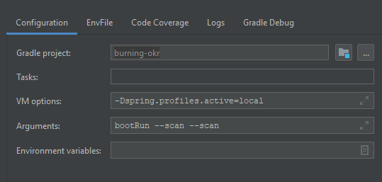
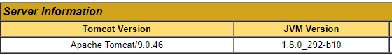

<p align="center"></p>

<p align="center">
<a href="http://www.burningokr.org" target="_blank">home</a> | <a href="https://burning-okr.gitbook.io/burningokr" target="_blank">documentation (de)</a> | <a href="https://burning-okr.gitbook.io/burningokr/v/en/" target="_blank">documentation (en) </a></p>
<br/><br/><br/>

# BurningOKR
Burning OKR is our vision to help consistently establish focus and alignment around company goals and embed transparency into the corporate culture.

BurningOKR has been developed as a web application with an Angular Frontend and Java Spring Boot Backend. As a database, Postgres SQL is used.

## Installation
You can install BurningOKR using the following technologies.
- Docker [Tutorial](/docker/README.md) *(Recommended for beginners)*
- Tomcat [Tutorial](/docs/tomcat_install.md)
- SNAP *Coming Soon*
- Azure Web App *Coming Soon*

## Getting started with the development
We are already working on a faster and easier installation process, so stay tuned.

### Checklist
0. Please follow our [Code Guidelines](/CODE_GUIDELINES.md) and [General information about implementations](/docs/developer_readme.md)
   0.1 You may also read the [Frontend-Readme](/frontend/README.md)
1. Install [PostgreSQL](/docs/postgres_install.md) or [MSSQL](/docs/mssql_install.md)
2. Install JDK 8. The Open JDK 8 can be downloaded [here](https://adoptopenjdk.net/upstream.html).
3. Install the (!) LTS Version of node & npm [here](https://nodejs.org/en/download/)
4. Clone the Repository with `git clone https://github.com/BurningOKR/BurningOKR`. The whole repository (including frontend and backend) is cloned.
5. Import the project into your favorable IDE (IntelliJ recommended, VS Code should also do the trick ). We recommend opening a separate window for the backend and frontend.
6. Run `npm install @angular/cli -g`
7. Run `npm install in the frontend folder`
8. [Configure](/docs/configure.md) the backend.

9. Start the frontend with `npm start`
10. Start the backend with the gradle `burning-okr-backend[boot-run]` configuration.

10.1 Alternatively create the configuration like 
### Source Code

The source code of the project consists of two parts. A Frontend SPA with the framework **Angular** and a **Spring Boot** project for the backend.

With `git clone https://github.com/BurningOKR/BurningOKR` the complete repository (including frontend and backend) is cloned.


### Frontend

With IntelliJ, you can now import the frontend project.


Next, you have to run `npm install` on the command line to download the dependencies.


With `npm start` the application is started and can now be called via `http://localhost:4200`.


### Backend

To open the project in IntelliJ, go to Import Project and select the file build.gradle in the folder backend. In the dialog that opens you have to select the field use auto-import.

If a configuration was not created automatically to start the project in IntelliJ, a gradle configuration must be created. For the gradle project, okr-tool must be selected, and for tasks, bootRun must be entered.

The backend project uses [Project Lombok](https://projectlombok.org). To use Project Lombok in your IDE, please refer to [using Lombok](https://projectlombok.org/setup/overview).

If PostgresSQL has already been successfully installed and configured in the previous step, the Spring Boot application can now be started.

The REST interfaces are listed under `localhost:8080/swagger-ui.html` and can be called there.

### Build and Test

With `gradlew build` the backend can be built.

With `ng build` the frontend can be built.

### FAQ

* **I get some errors with npm install (python2, node-sass, node-gyp):** <br>
  Use the LTS version of node, not the current! https://nodejs.org/en/download/


* **I get a _entityManagerFactory Persistence Exception_ / error on instancing entityManagerFactory when starting the backend**<br>
  Please make sure to use JDK8 on Tomcat.
  You can check the JDK Version on `localhost:8080/manager`. Then you can log in with the tomcat user for the gui.
  It should look like this
  


* **I can't log in into the tomcat manager gui**
  Create a tomcat user for the web management console.
  You need to do this to access the manager app, that comes with tomcat.
  Start by editing the `tomcat-users.xml` file.
  Then add the following lines above `</tomcat-users>` (at the bottom of the file)
    ```xml
        <role rolename="manager-gui"/>
        <role rolename="admin-gui"/>
        <user username="username" password="password" roles="manager-gui,admin-gui"/>
    </tomcat-users>
    ```
  Change `username` and `password` to a secure account.

## Contribute

Thank you to all the people and bots who already contributed to BurningOKR!

<!-- generate new contributor list.. https://contributors-img.firebaseapp.com/ -->
<a href="https://github.com/BurningOKR/BurningOKR/graphs/contributors">
  
</a>

Made with [contributors-img](https://contrib.rocks).

<br/>

## User Documentation

The current user documentation is available at https://burning-okr.gitbook.io/burningokr


## Contact
<br/>

You can write an [E-Mail](mailto:burningokr@brockhaus-ag.de) or mention our Twitter account [@BurningOKR](https://twitter.com/BurningOkr).

<br/>

## License
<br/>

BurningOKR was initially developed as part of a training project at [BROCKHAUS AG](http://brockhaus-ag.de) in Lünen.

Only an Open Source solution can unfold its true potential. That's why we released it on GitHub as an open-source project under the Apache 2.0 license.

See [LICENSE.txt](LICENSE.txt)

