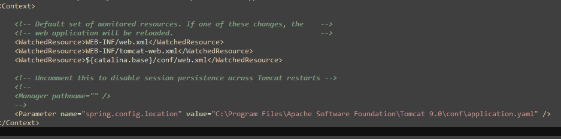

### Configuration (Windows and Linux)
#### Configuration if you used a docker run command
If you installed the Postgres database through a `docker run command`, please stay in this section.
1. If you haven't changed anything in the `docker run command`, you can simply rename the `application-local.docker.yaml` to `application-local.yaml`.

Otherwise, you have to change the yaml accordingly (user,password,port).

#### Docker configuration with docker-compose
If you only want to use the Burning OKR tool and don't need a local development environment, please head to this [Configuration](/docker/README.md#configuration-windows-and-linux).

#### Manual installation
If you have installed Postgres manually on your machine, you are in the right place.
This documentation ist for the local dev environment.

1. Go to "backend/burning-okr/burning-okr-app/src/main/resources/".
2. Copy the "application.yaml.sample" and create an "application-local.yaml".
3. Replace the placeholders with values.
* url
* username
* password

4. If not needed, delete the placeholders at mail.

5. Under auth-mode select `local` or `azure`. If you are not sure, use `local`.
For more information about the usage of Azure-AD look in the [docker configuration](/docker/README.md#configuration-windows-and-linux).
6. Optional: Please note that the yaml application will be overwritten if you deploy a new version.
   To prevent it from happening go to the tomcat context-configuration file under `<tomcat9-installation>/conf/context.xml` and enter the following in the context
```xml
    <Parameter name="spring.config.location" value="C:\Program Files\Apache Software Foundation\Tomcat 9.0\conf\application.yaml" />
</Context>
```


7. Save

You have now configured the application.yaml :)
