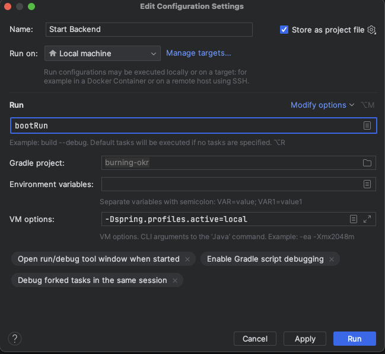

# Development

## Installation for Production

When you want to use BurningOKR in your company please refer to [this documentation](../README.md). **This page is only for development purposes!**

You can use Keycloak for the Development, by reading the following [documentation](keycloak_development_install.md) **(Optional)**

## Getting started with the development

We are already working on a faster and easier installation process, so stay tuned.

### Checklist

0. Please follow our [Code Guidelines](../CODE_GUIDELINES.md) and [General information about implementations](developer_readme.md) (You may also read the [Frontend-Readme](../frontend/README.md))
1. Install [PostgreSQL](postgres_install.md) 9.5.14 or higher or [MSSQL](mssql_install.md)
2. Install JDK 17. The Open JDK 17 can be downloaded [here](https://www.oracle.com/java/technologies/javase/jdk17-archive-downloads.html)
3. Install the (!) LTS Version of node & npm [here](https://nodejs.org/en/download/)
4. Install Angular

### Source Code

The source code of the project consists of two parts. A Frontend SPA with the framework **Angular** and a **Spring Boot** project for the backend.

With `git clone https://github.com/BurningOKR/BurningOKR` the complete repository (including frontend and backend) is cloned.

### Frontend (IntelliJ)

1. With IntelliJ, you can now import the frontend project.
2. Next, you have to run `npm install` on the command line to download the dependencies.
3. With `npm start` the application is started and can now be called via `http://localhost:4200`.

### Backend (IntelliJ)

To open the project in IntelliJ, go to Import Project and select the file build.gradle in the folder backend. In the dialog that opens you have to select the field use auto-import.

If a configuration was not created automatically to start the project in IntelliJ, a gradle configuration must be created. For the gradle project, okr-tool must be selected, and for tasks, bootRun must be entered.  
  

The backend project uses [Project Lombok](https://projectlombok.org). To use Project Lombok in your IDE, please refer to [using Lombok](https://projectlombok.org/setup/overview).

If PostgresSQL has already been successfully installed and configured in the previous step, the Spring Boot application can now be started.

## Backend (without IntelliJ)

To start the application without IntelliJ, switch to backend/burning-okr and run `./gradlew bootRun -Dspring.profiles.active=local`. On some UNIX systems there might be some issues with gradle regarding finding the JDK.  

If exceptions occur, try running `export JAVA_HOME=/Library/Java/JavaVirtualMachines/jdk<version>.jdk/Contents/Home` (replace the path with the actual path of your JDK). Then, restart your shell or run `source ~/.bash_profile`.

### Build

With `gradlew build` the backend can be built.

With `ng build` the frontend can be built.

## Contribute

Thank you to all the people and bots who already contributed to BurningOKR!

<!-- generate new contributor list.. https://contributors-img.firebaseapp.com/ -->

Made with: [contributors-img](https://contrib.rocks).
