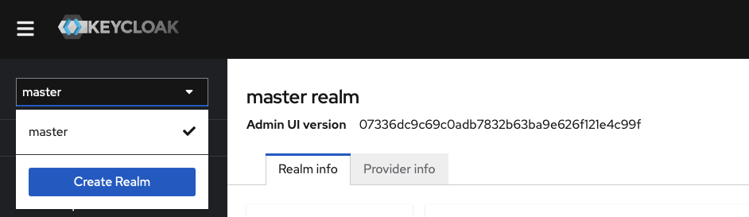
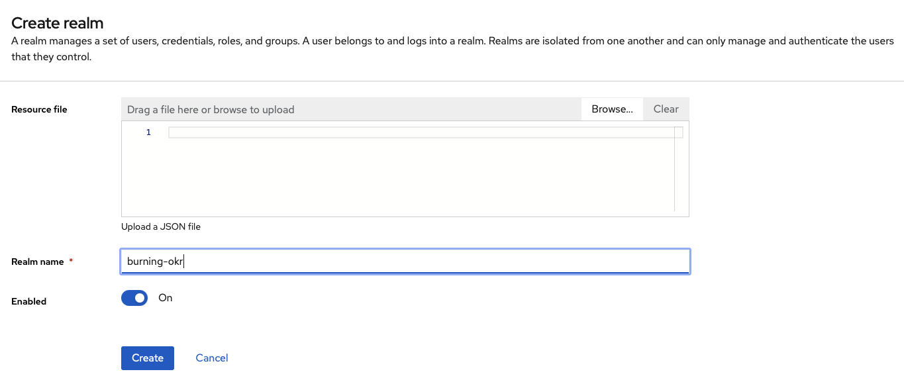
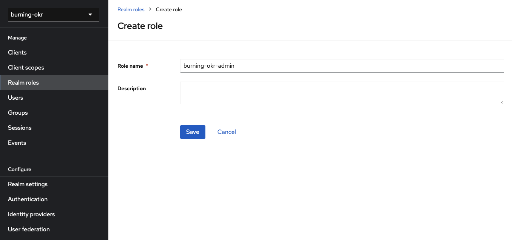
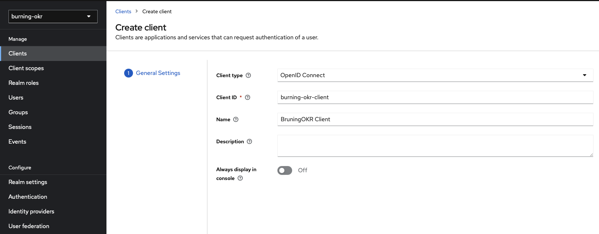
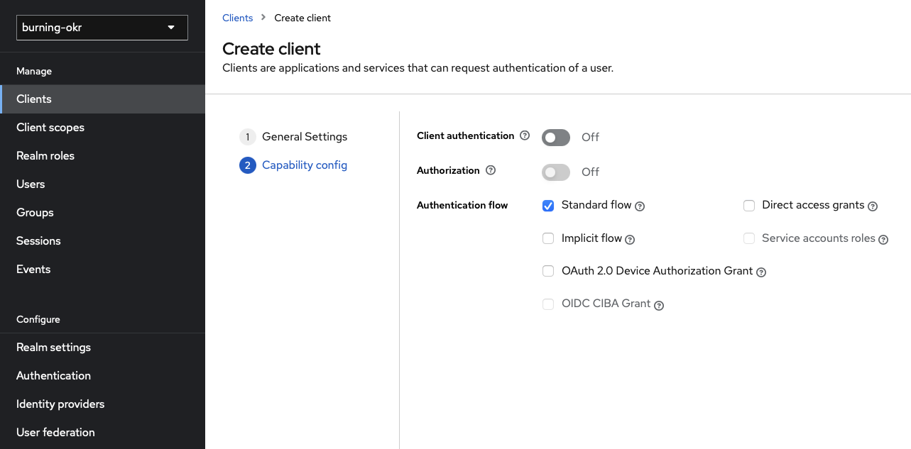
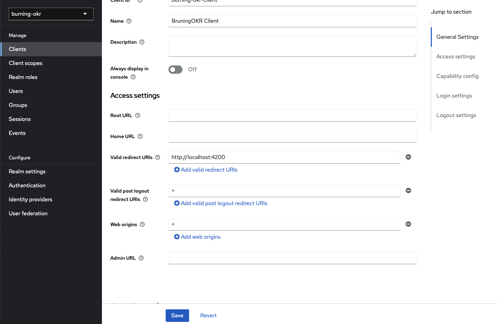
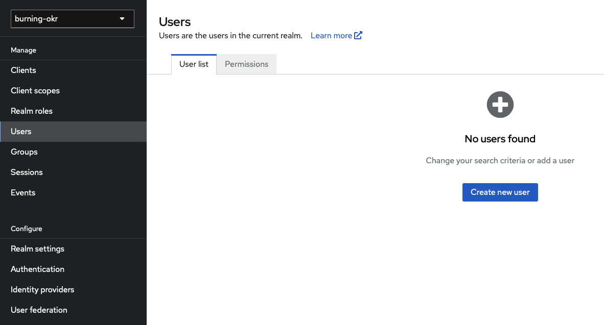
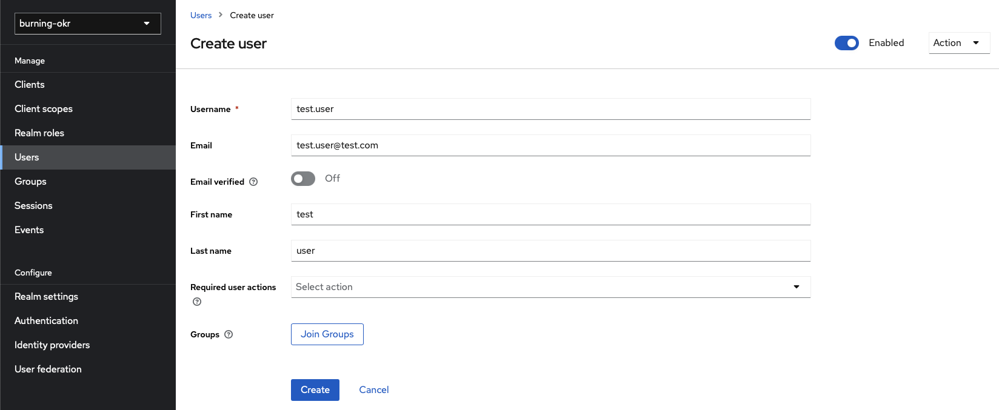
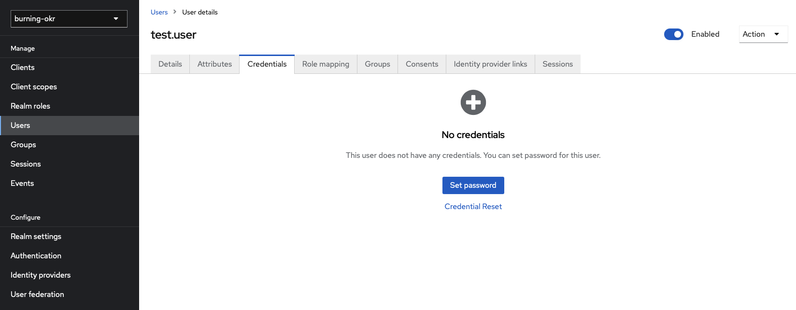
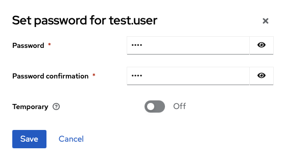

# Install Keycloak

**This README document is provided for development use!**

## Disclaimer

We are a small team of developers and can't ensure that documentation about third party software is always up-to-date. When you want to use Keycloak for production you can totally do so, but please refer to the official documentation before doing so.

The content provided in this Readme file is intended solely for development and informational purposes. It is designed to guide developers and technical users in understanding and implementing the features and functionalities of the described software. <span style=color:#E52B50>This document does not constitute official product documentation and should not be considered exhaustive or definitive.</span>

Developers are encouraged to refer to the [official documentation](https://www.keycloak.org/getting-started/getting-started-docker) and resources provided by the software's maintainers for the most accurate and current information.
While efforts have been made to ensure the accuracy of the information contained in this document, no guarantees are made regarding the completeness, correctness, or suitability of the content for specific purposes. Users are advised to exercise their own discretion and verify information through official sources before making decisions based on the content of this Readme.

## Overview

Welcome to the Keycloak Readme!
This document provides a high-level overview of Keycloak, an open-source identity and access management solution developed by Red Hat. Keycloak simplifies the process of securing applications and services by offering a centralized authentication and authorization platform.

## What is Keycloak?

Keycloak is a robust and extensible Identity and Access Management (IAM) system that helps organizations manage user identities, authentication, and authorization in a secure and user-friendly manner. It serves as a comprehensive solution for handling user authentication, single sign-on (SSO), and authorization, enabling developers to focus on building applications while delegating user management concerns to Keycloak.

## Getting started

To start using Keycloak, follow the official documentation which is provided from Keycloak: <https://www.keycloak.org/getting-started/getting-started-docker>

You can use this docker-compose to start Keycloak on your machine:

```yaml
version: '3'
name: 'keycloak'
services:
  postgres:
    image: postgres:latest
    environment:
      POSTGRES_PASSWORD: <your_strong_postgres_password>
      POSTGRES_USER: <your_postgres_username>
      POSTGRES_DB: keycloak_db
  keycloak:
    image: quay.io/keycloak/keycloak:20.0
    depends_on:
      - postgres
    environment:
      KEYCLOAK_ADMIN: <your_admin_username>
      KEYCLOAK_ADMIN_PASSWORD: <your_admin_password>
      KC_DB: postgres
      KC_DB_URL: jdbc:postgresql://postgres/keycloak_db
      KC_DB_USERNAME: <your_postgres_username>
      KC_DB_PASSWORD: <your_strong_postgres_password>
    ports:
      - 9090:8080
    command:
      - start-dev
```

### First setup

1. Make sure to replace the elements surrounded by `<` and `>` with your own usernames and passwords.
2. Login to the admin console.

### Create Realm and Realm admin role

1. Create a new realm named `burning-ok`.  
2. Add a new `Realm Role` named `burning-okr-admin`. This role will be assigned to admin users. 

### Add new client to Realm

1. Add a new client with `client type: OpenID Connect` and `Client ID: burning-okr-client`.  
2. Modify the `Access settings`. 

### Create your first test user

1. Navigate to `Users` in the side menu and click `Create new user`. 
2. Enter the users data. 
3. Click on `Create` and navigate to `Credentials`. Than click `Set password`. 
4. Set a password and disable the `Temporary`-switch. 

### Assign the admin role to a user

1. Select the user you want give admin privileges to in the `User`-tab. Than navigate to `Role mapping`. 
2. Click `Assign role` and assign the `burning-okr-admin` role.

## Information for production

Please make sure to use keycloak in the correct configuration for production. The steps listed above are for local development.
