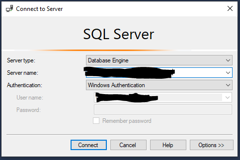
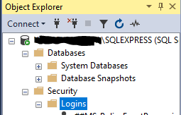
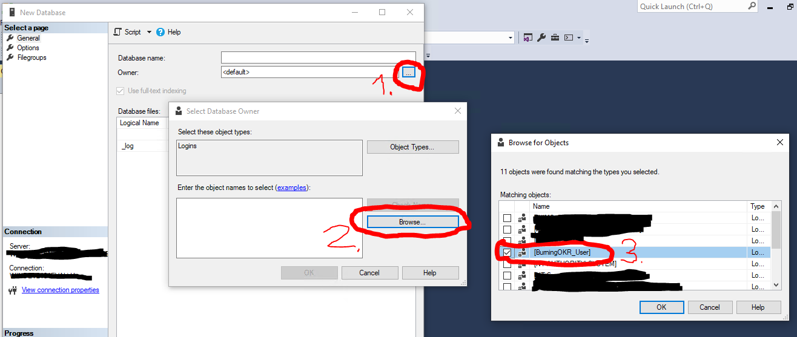

# Install and Setup Microsoft SQL Server
## Windows

1. Download Microsoft SQL Server: https://www.microsoft.com/de-de/sql-server/sql-server-downloads
    - You will need a license for production workloads.
    - You can use SQL Server Express for development purposes.
    - You can find more information on Microsofts website.
    
2. Install Microsoft SQL Server using the installer. Select **Basic Installation**
   
   After the installer has finished, you will see the following Screen. Do not close it yet.
   
   
3. Click on `Install SSMS`. Your Web Browser will open.
4. On the Website, click on `Download SQL Server Management Studio (SSMS)`. Your Download will start.
5. Run the downloaded setup and click on `Install`. You can close all windows when the installation is complete.
6. Open `Microsoft SQL Server Management Studio` (SSMS).
    1. SSMS will prompt you to connect to a Server on startup. Do not change any values an click on connect.
       This will connect you to the local SQL Server instance that was installed earlier.
       
    2. On the left is the `Object Explorer`. Expand the entries so that it looks like this:
       
    3. Create a new Login by right clicking `Logins` in the `Object Explorer` and selecting `New Login...`.
        1. Set a meaningful `Login Name`. For Example `BurningOKR_User`.
        2. Select `SQL Server authentication`
        3. Set a secure `Password`.
        4. Remove the ticks from `Enforce password expiration` and `User must change password at next login`.
        5. Click on `Ok`
    4. Create a new Database by right clickng `Databases` in the `Object Explorer` and selecting `New Database...`
        1. Set a meaningful `Database name`. For Example `okr`
        2. Click on `...` next to `Owner`. A new Window opens. Click on `Browse...`. A new Window Opens. Select the Login, that was created earlier.
           
        3. Click on `Ok` in every open window.
    5. You can now close `Microsoft SQL Server Management Studio`.
7. Open `SQL Server Configuration Manager`
    1. Click on `SQL Server Network Configuration`.
    2. Click on `Protocols for SQLEXPRESS`.
    3. Right Click on `TCP/IP` and select `Properties`.
    4. Click on the `IP Addresses` Tab.
    5. Scroll down to `IPALL`
    6. Remove any value from `TCP Dynamic Ports`
    7. Set the `TCP Port` to 1433.
    8. Click `Ok`.
    9. Click on `SQL Server Services`
    10. Right Click on `SQL Server (SQLEXPRESS)` and select `Restart`.
    11. Close the SQL Server Configuration Manager.
8. Done. You SQL Server is now ready for BurningOKR. You can now go back to
   the Installation Tutorial.
