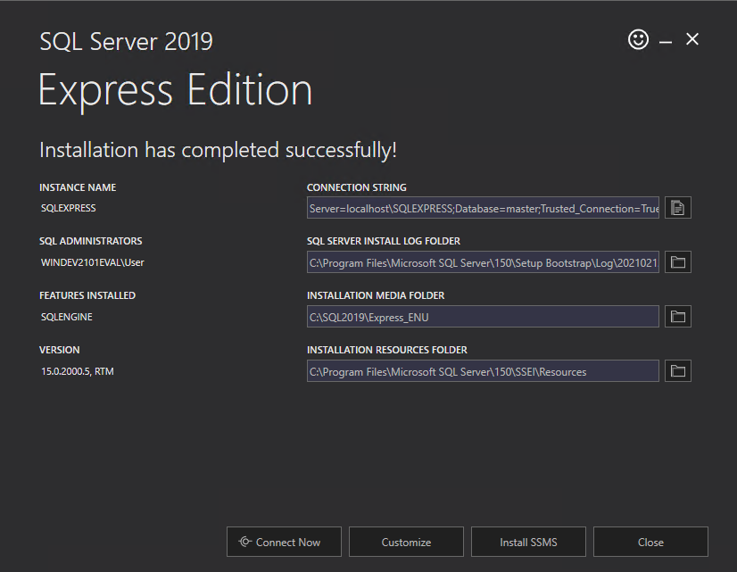

# Install and Setup Microsoft SQL Server
## Windows

1. Download Microsoft SQL Server: https://www.microsoft.com/de-de/sql-server/sql-server-downloads
    - You will need a license for production workloads.
    - You can use SQL Server Express for development purposes.
    - You can find more information on Microsofts website.
    
2. Install Microsoft SQL Server using the installer. Select **Basic Installation**
   
   After the installer has finished, you will see the following Screen. Do not close it yet.
   
   
3. Click on `Install SSMS`. Your Web Browser will open.
4. On the Website, click on `Download SQL Server Management Studio (SSMS)`. Your Download will start.
5. Run the downloaded setup and click on `Install`

