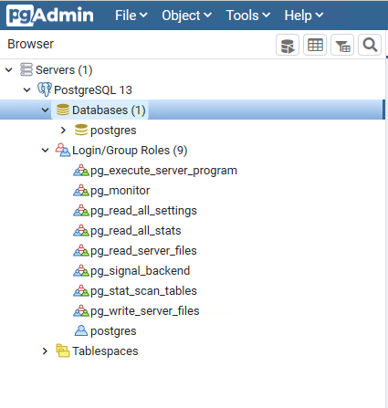
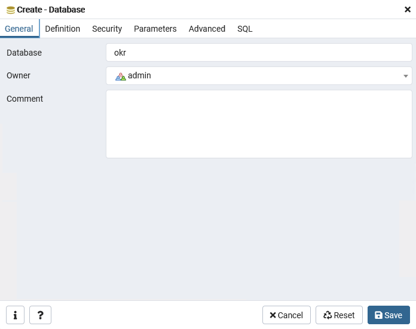
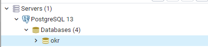

# Install and Setup PostgreSQL

## Overview
You haven't created a database yet? Then you are at the right place!

1. We need to provide a separate PostgreSQL database for the backend application.

2. Additionally, we need to create a user who can connect to the database.

Note: Please remember the **username**, **password** and **database-name** you have chosen.
You will need those in the coming application yaml configuration.

## Windows
1. Install PostgreSQL (Version 9.5 or higher): https://www.enterprisedb.com/downloads/postgres-postgresql-downloads
    1. IMPORTANT: During installation you have to set a password for the postgres superuser and you have to choose a port number. You must remember these two values.
2. The PostgreSQL Installer also should have installed pgAdmin4. Search for pgAdmin4 on your computer and start it. This should open your browser. You may have to set a master password for pgAdmin on the first startup.
3. On the left, you should see your server browser. 

    
    
    Expand all entries as shown in the image.
4. Right click on "Login/Group Roles" and choose "Create > Login/Group Role..."
    1. In the general tab, set the "Name" to a meaningful name, like "admin" or "BurningOKR".
    2. In the definition tab, set a strong password.
    3. Click on "Save" to exit the window.
5. In the server browser right click on "Databases" and choose "Create > Database...".
    1. Give your database a name by filling out the database field. You can choose any name, but it is recommended to use a meaningful name like "okr" or "burningokr".
    2. Set the owner to "admin", or the user you just created.
    
        
        
    3. Click on "Save" to exit the window.
6. You should now see two databases and the admin login role in your server browser:
   
   
   
   Your Database is now ready for usage. You can now close pgAdmin4.
   You can now go back to the Installation Tutorial.
   
## Linux (Ubuntu)
1. Install PostgreSQL: 
    ```
    sudo apt install postgresql postgresql-contrib
    ```
2. Create the "admin" user role for BurningOKR: 
    ```
    sudo -u postgres createuser --interactive --pwprompt
    ```
    Enter name and password for the new role, then answer with "n" to the three questions. This should look like this:
    ````
   Enter name of role to add: admin
   Enter password for new role:
   Enter it again:
   Shall the new role be a superuser? (y/n) n
   Shall the new role be allowed to create databases? (y/n) n
   Shall the new role be allowed to create more new roles? (y/n) n
   ````
3. Create a database for BurningOKR: 
    ```
    sudo -u postgres createdb okr -O admin
   ```
   Your Database is now ready for usage.
   You can now go back to the Installation Tutorial.
