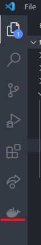
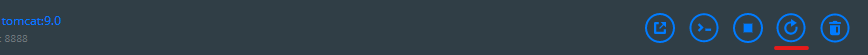

# Run Tomcat in Docker

### For this guide you need to have:

- [X] docker installed on your computer
- [X] a working internet connection to download the tomcat image
- [X] vs code with docker extension (without will be added soon)

## Create docker volumes

```powershell
docker volume create tomcat_conf
```

## Starting the container

At first you need to pull the official tomcat-image from dockerhub or run this command:  
```powershell
docker run -it -v tomcat_conf:/usr/local/tomcat/conf/ -p 8888:8080 --name tomcat tomcat:9.0
```
This will pull and start the tomcat-container. Tomcat will be accessible via port 8888 on your host machine.
<!-- add persistence from conf file in webapp manager folder-->

## After starting the container

### Creating a user for manager- and admin-gui

Now we will need to modify some files within the running container. First we will create a user for accessing the manager- and admin-gui. To do so start VS Code and navigate to the docker tab on the left:  

  

After navigating there you will see your running containers in the top left corner. Unfold the container named `tomcat`. Navigate in the `Files` folder to `/usr/local/tomcat/conf/`. Open the `tomcat-users.xml` and replace the content with the following:  

```xml
<?xml version="1.0" encoding="UTF-8"?>

<tomcat-users xmlns="http://tomcat.apache.org/xml"
              xmlns:xsi="http://www.w3.org/2001/XMLSchema-instance"
              xsi:schemaLocation="http://tomcat.apache.org/xml tomcat-users.xsd"
              version="1.0">

  <role rolename="manager-gui"/>
  <user username="tomcat" password="changeme" roles="manager-gui,admin-gui"/>

</tomcat-users>
```
It is recommended to replace the password with somthing more complex. After that save the file. 

### Modify context.xml

Open `context.xml` in the same directory and replace the content with the following:  
```xml
<?xml version="1.0" encoding="UTF-8"?>

<Context antiResourceLocking="false" privileged="true" >

  <Manager sessionAttributeValueClassNameFilter="java\.lang\.(?:Boolean|Integer|Long|Number|String)|org\.apache\.catalina\.filters\.CsrfPreventionFilter\$LruCache(?:\$1)?|java\.util\.(?:Linked)?HashMap"/>     
</Context>
```
After that navigate to `/usr/local/tomcat/webapps.dist/manager/META-INF` and open there `context.xml`. Replace the content with the same as described above.  

## Changing the used webapp folder

Now we need to change the used web app folder. For this we nee to navigate to the folder: `/usr/local/tomcat/conf/`.  
Open the `server.xml` 
Then replace the Host section with the following and save the file.  
```xml
<Host name="localhost"  appBase="webapps.dist" unpackWARs="true" autoDeploy="true">
  <Valve className="org.apache.catalina.valves.AccessLogValve" directory="logs"
               prefix="localhost_access_log" suffix=".txt"
               pattern="%h %l %u %t &quot;%r&quot; %s %b" />

</Host>
```
<!-- ask Rouven for folder and file, which need to be modified-->

## Restart the container

Now restart the container via cli or docker desktop interface:  
- docker desktop: 

## Access Tomcat

You can now access Tomcat via `localhost:8888`. To access the manager- or admin-gui enter your [created username and password](#creating-a-user-for-manager--and-admin-gui).