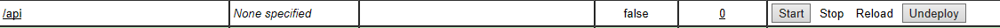
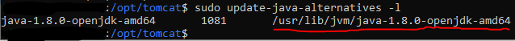
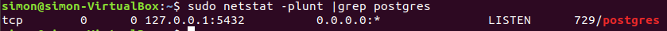

# Tomcat
## Getting Started
### Windows

#### Prerequisites
1. Install and Setup a supported Database:
    - [PostgreSQL (Tutorial)](./postgres_install.md)
    - [Microsoft SQL Server (Tutorial)](./mssql_install.md)
2. Install Java 8: https://www.java.com/en/download/ (**Only this version is supported**! Please make sure that Tomcat uses Java 8 JDK)
3. Install Tomcat 9: https://tomcat.apache.org/download-90.cgi (Download the 32-bit/64-bit Windows Service Installer).<br>
   *You also have to set up a gui account in the installation!*

#### Deploying Release
4. Go to https://github.com/BurningOKR/BurningOKR/releases/latest and download the .war file and the frontend-de.zip or frontend-en.zip (depends on your preferred language)
5. Rename the .war file to "api.war".
6. Place the api.war in the following directory: `C:\Program Files (x86)\Apache Software Foundation\Tomcat 9.0\webapps`. Once this is done, you should see that a new directory called "api" was automatically created within this directory.
7. Delete all files in the directory `C:\Program Files (x86)\Apache Software Foundation\Tomcat 9.0\webapps\ROOT`
8. Open the frontend-de/en.zip and move to the directory `fronted\dist\OKRFrontEnd`.
9. Copy all files within this directory to `C:\Program Files (x86)\Apache Software Foundation\Tomcat 9.0\webapps\ROOT`
10. Within the `ROOT` directory, create a new directory called `WEB-INF`
11. Place the `web.xml`, which can be downloaded [here](./files/web.xml) (right click the "raw" button and select "save as...") in the `WEB-INF` directory.

#### Configuration and Start
12. Configure BurningOKR. See [Configuration](#configuration-windows-and-linux).<br>
13. Open your browser on http://localhost:8080/manager and login with your tomcat administrator account
14. Click "Start" on the "/api" application
    
15. Done. You can now open your browser on http://localhost:8080 and see BurningOKR.

### Linux (Ubuntu)
1. Install and Setup a supported Database:
    - [PostgreSQL (Tutorial)](./postgres_install.md)

2. Install Java 8: 
    ```
    sudo apt install openjdk-8-jre-headless
    ```
3. Create a usergroup and user for Tomcat: 
    ```
    sudo groupadd tomcat
    sudo useradd -s /bin/false -g tomcat -d /opt/tomcat tomcat
    ```
4. Go into the "tmp" folder and then download and extract Tomcat: 
    ```
    cd /tmp
    sudo apt install curl
    curl -O https://mirror.synyx.de/apache/tomcat/tomcat-9/v9.0.39/bin/apache-tomcat-9.0.39.tar.gz
    sudo mkdir /opt/tomcat
    sudo tar xzvf apache-tomcat-9*tar.gz -C /opt/tomcat --strip-components=1
    ```
5. Add privileges for the Tomcat user to access the Tomcat directory:
    ```
   cd /opt/tomcat
   sudo chgrp tomcat /opt/tomcat –R
   sudo chmod g+r conf –R
   sudo chmod g+x conf
   sudo chown tomcat webapps/ work temp/ logs –R
   ```
6. Find the "JAVA_HOME" path:
    ```
   sudo update-java-alternatives -l
   ```
   
   
   Copy the path from the output and save it somewhere.
7. Create a new Systemd service by creating a tomcat.service file:
    ```
    sudo nano /etc/systemd/system/tomcat.service
    ```
    And paste this content into it:
    ```
    [Unit]
    Description=Apache Tomcat Web Application Container
    After=network.target
    
    [Service]
    Type=forking
    
    Environment="JAVA_HOME=<YOUR JAVA_HOME PATH FROM STEP 9>"
    Environment="CATALINA_PID=/opt/tomcat/temp/tomcat.pid"
    Environment="CATALINA_HOME=/opt/tomcat"
    Environment="CATALINA_BASE=/opt/tomcat"
    Environment='CATALINA_OPTS=-Xms512M –Xmx1024M –server –XX:+UserParallelGC’
    Environment=’JAVA_OPTS=-Djava.awt.headless=true Djava.security.egd=file:/dev/./urandom’
    
    ExecStart=/opt/tomcat/bin/startup.sh
    ExecStop=/opt/tomcat/bin/shutdown.sh
    
    User=tomcat
    Group=tomcat
    UMask=0007
    RestartSec=10
    Restart=always
    
    [Install]
    WantedBy=multi-user.target
    ```
    Do not forget to insert your JAVA_HOME path fromstep 9 into the first `Environment` entry.

    **Save** and **Exit** the file by using `Ctrl+X`, followed by `y`es and `Enter`.
8. Reload the system daemon and start the tomcat service, so that the changes take place:
    ```
    sudo systemctl daemon-reload
    sudo systemctl start tomcat
    sudo systemctl status tomcat
    ```
    The status should be **active (running)**
    
    Exit by pressing `q`.
9. Allow tomcat through the firewall.
    ```
    sudo ufw allow 8080
    ```
10. Create a tomcat user for the web management console.
    You need to do this to access the manager app, that comes with tomcat.
    Start by editing the `tomcat-users.xml` file
    ```
    sudo nano /opt/tomcat/conf/tomcat-users.xml
    ```
    Then add the following lines above `</tomcat-users>` (at the bottom of the file)
    ```xml
        <role rolename="manager-gui"/>
        <role rolename="admin-gui"/>
        <user username="username" password="password" roles="manager-gui,admin-gui"/>
    </tomcat-users>
    ```
    Change `username` and `password` to a secure account.
    
    **Save** and **Exit** the file by using `Ctrl+X`, followed by `y`es and `Enter`.
    
    Restart tomcat afterwards:
    ```
    sudo systemctl restart tomcat
    ```
11. Download the latest BurningOKR release:
    1. Change to temp directory
        ```
        cd /tmp
        ```
    2. Download the backend .war file:
        ```
        wget https://github.com/$(wget https://github.com/burningokr/burningokr/releases/latest -O - | egrep '/.*/.*/.*burning-okr-app-.*war' -o)
        ```
    3. Rename the .war file to api.war
        ```
        mv burning-okr-app-*.war api.war
        ```
    4. Download the frontend .zip file:
        1. **If you want german language, use this command**
            ```
            wget https://github.com/$(wget https://github.com/burningokr/burningokr/releases/latest -O - | egrep '/.*/.*/.*frontend-de.zip' -o)
            ```
        2. **If you want english language, use this command**
            ```
            wget https://github.com/$(wget https://github.com/burningokr/burningokr/releases/latest -O - | egrep '/.*/.*/.*frontend-en.zip' -o)
            ```
12. Install the BurningOKR release:
    1. Install the war file:
        ```
        sudo mv /tmp/api.war /opt/tomcat/webapps/api.war
        ```
    2. Install the zip file:
        1. Clear the tomcat ROOT directory:
            ```
            sudo su
            sudo rm -r /opt/tomcat/webapps/ROOT/*
            ```
        2. Install unzip
            ```
            sudo apt install unzip
            ```
        3. Unzip the zip file to the ROOT directory:
            ```
            sudo unzip -j /tmp/frontend-*.zip "frontend/dist/OKRFrontEnd/*" -d /opt/tomcat/webapps/ROOT/
            ```
        4. Create a WEB-INF directory
            ```
            sudo mkdir /opt/tomcat/webapps/ROOT/WEB-INF
            ```
        5. Download a web.xml and place it in the WEB-INF directory
            ```
            cd /opt/tomcat/webapps/ROOT/WEB-INF
            sudo wget https://raw.githubusercontent.com/BurningOKR/BurningOKR/development/docs/files/web.xml
            exit
            ```
13. Configure BurningOKR. See [Configuration](#configuration-windows-and-linux).
14. Open your browser on http://localhost:8080/manager and login with your tomcat administrator account which was created in step 12.
15. Click "Start" on the "/api" application
    
16. Done. You can now open your browser on http://localhost:8080 and see BurningOKR.


### Configuration (Windows and Linux)
1. Go to the webapps directory of your tomcat server
    1. For Windows:
    ```
    C:\Program Files (x86)\Apache Software Foundation\Tomcat 9.0\webapps
    ```
    2. For Linux:
    ```
    sudo su
    cd /opt/tomcat/webapps
    ```
2. Go to `api\WEB-INF\classes`
3. Edit the `application.yaml` and overwrite everything with the following sample:

```yaml
spring:
  datasource:
#   url: jdbc:sqlserver://localhost;databaseName=<DATABASE NAME>;Initial Catalog=<DATABASE NAME> # For Microsoft SQL Server
    url: jdbc:postgresql://localhost:<PORT>/<DATABASE NAME>?useSSL=false # For PostgreSQL Server
    username: <login name>
    password: <login Password>

  jpa:
    hibernate:
      ddl-auto: none
    properties:
      hibernate:
        dialect: org.hibernate.dialect.PostgreSQLDialect # For postgres
#       dialect: org.burningokr.dialects.SQLServer2012UUIDFixDialect # For Microsoft SQL Server
        format_sql: true
        globally_quoted_identifiers: true

  flyway:
    baseline-on-migrate: true
    baseline-version: 0
    locations: classpath:db/migration/{vendor}

  mail:
    username: <Email username>
    password: <Email password>
    host: <Email server url>
    port: <Email server port>
    properties:
      mail:
        smtp:
          socketFactory:
            class: javax.net.ssl.SSLSocketFactory
          auth: true
      test-connection: false

  messages:
    basename: messages
    pid:
      file: ./shutdown.pid

## This section is optional.
## If you want to use an Azure Active Directory for authentication, uncomment this.
#
#azure:
#  ad:
#    issuer: <Azure issuer>
#    azureGroups:
#      - name: <Azure ad group name>
#        id: <Azure ad group id>
#
#security:
#  oauth2:
#    client:
#      clientId: <OAuth client id>
#      clientSecret: <OAuth client secret>
#      accessTokenUri: <OAuth access token url>
#      userAuthorizationUri: <OAuth use authorization token url>
#      clientAuthenticationScheme: form
#      scope: openid
#      grant-type: client_credentials
#      auto-approve-scopes: '.*'
#      token-name: access_token
#    resource:
#      userInfoUri: https://graph.microsoft.com/v1.0/me/
#      preferTokenInfo: false

system:
  configuration:
    auth-mode: <Your preferred auth-mode ("local" or "azure")>
    api-endpoint: ""
    token-endpoint-prefix: "/api"
```

4. Insert the port and the database name of your database, that you have created earlier under `spring: > datasource: > url: ...`. The database name is the name, that you provided when creating the database. To get the port number, you have to do the following steps.
   
    **For Windows:**
   
   The port number was set in step 1 of the PostgreSQL Tutorial.
    
   **For Linux:**
   ```
   sudo apt-get install net-tools
   sudo netstat -plunt |grep postgres
   ```
    
   

   When you want to use a **Microsoft SQL Server** instead of PostgreSQL, you have to remove the `#` in front of `url` and `dialect`.
   Then place a `#` in front of the respective other `url` and `dialect` line.
   Make sure that the indentation matches with the rest of the block.

5. Insert the username and password of the login role of your database server under `spring: > datasource: > username: ...` and `spring: > datasource: > password: ...`
6. You can insert the url, port, username and password of your mail server if you have one under `spring: > mail: > ....`. Otherwise remove the placeholders and leave these configurations empty.
7. Decide if you want to use a local user database (also saved in the postgres database) or if you want to use Azure Active Directory as your userbase by replacing the placeholder under `system: > configuration: > auth-mode: ...` with either `local` or `azure`.
8. **When using an Azure Active Directory as the userbase, you also need to do the following steps. You do not need to this, when you are using the local user database.**
    1. Uncomment the Azure Active Directory configuration by removing the first "#" of each line.
    2. Replace `<OAuth client id>`, `<OAuth client secret>`, `<OAuth access token url>` and `<OAuth use authorization token url>` with the corresponding values from your Azure Active Directory App registration.
    3. Replace `<Azure issuer>` with the azure issuer URI. e.g. `https://<login-provider>/<tenant-id>/v2.0`
    4. Add as many Azure Active Directory Groups as you want. All users from these groups will be authorized, to use the BurningOKR Tool. The rest will not be able to use the tool. You need to specify the `<Azure ad group name>` and the `<Azure ad group id>`.
    5. To add more groups, you need to add more entries to the list. Here is an example:
```yaml
azureGroups:    
  - name: <Azure ad group name>
    id: <Azure ad group id>
  - name: <Azure ad group name>
    id: <Azure ad group id>
  - name: <Azure ad group name>
    id: <Azure ad group id>
```
9. **Save** and **Exit** the file by using `Ctrl+X`, followed by `y`es and `Enter`.
---
Optional: Please note that the yaml application will be overwritten if you deploy a new version.
To prevent it from happening go to the tomcat context-configuration file under `<tomcat9-installation>/conf/context.xml` and enter the following in the context
```xml
    <Parameter name="spring.config.location" value="C:\Program Files\Apache Software Foundation\Tomcat 9.0\conf\application.yaml" />
</Context>
```

