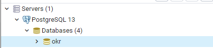

# Tomcat
## Getting Started
### Windows

1. Install PostgreSQL (Version 9.5 or higher): https://www.enterprisedb.com/downloads/postgres-postgresql-downloads
    1. IMPORTANT: During installation you have to set a password for the postgres superuser and you have to choose a port number. You must remember these two values.
2. The PostgreSQL Installer also should have installed pgAdmin4. Search for pgAdmin4 on your computer and start it. This should open your browser. You may have to set a master password for pgAdmin on the first startup.
3. On the left, you should see your server browser. 

    
    
    Expand all entries as shown in the image.
4. Right click on "Login/Group Roles" and choose "Create > Login/Group Role..."
    1. In the general tab, set the "Name" to "admin".
    2. In the definition tab, set a strong password.
    3. Click on "Save" to exit the window.
5. In the server browser right click on "Databases" and choose "Create > Database...".
    1. Give your database a name by filling out the database field. You can choose any name, but it is recommended to use a meaningful name like "okr" or "burningokr".
    2. Set the owner to "admin"
    
        
        
    3. Click on "Save" to exit the window.
6. You should now see two databases and the admin login role in your server browser:
   
   
   
   Your Database is now ready for usage. You can now close pgAdmin4.
7. Install Java 8: https://www.java.com/en/download/
8. Install Tomcat 9: https://tomcat.apache.org/download-90.cgi (Download the 32-bit/64-bit Windows Service Installer)
9. Go to https://github.com/BurningOKR/BurningOKR/releases/latest and download the .war file and the frontend-de.zip or frontend-en.zip (depends on your preferred language)
10. Rename the .war file to "api.war".
11. Place the api.war in the following directory: `C:\Program Files (x86)\Apache Software Foundation\Tomcat 9.0\webapps`. Once this is done, you should see that a new directory called "api" was automatically created within this directory.
12. Delete all files in the directory `C:\Program Files (x86)\Apache Software Foundation\Tomcat 9.0\webapps\ROOT`
13. Open the frontend-de/en.zip and move to the directory `fronted\dist\OKRFrontEnd`.
14. Copy all files within this directory to `C:\Program Files (x86)\Apache Software Foundation\Tomcat 9.0\webapps\ROOT`
15. Within the `ROOT` directory, create a new directory called `WEB-INF`
16. Place the `web.xml`, which can be downloaded [here](./files/web.xml) in the `WEB-INF` directory.
17. Configure BurningOKR. See [Configuration](#configuration-windows-and-linux).
18. Open your browser on http://localhost:8080/manager and login with your tomcat administrator account
19. Click "Start" on the "/api" application
    
20. Done. You can now open your browser on http://localhost:8080 and see BurningOKR.

### Linux
Coming soon...

### Configuration (Windows and Linux)
1. Go to the webapps directory of your tomcat server
    1. For Windows: `C:\Program Files (x86)\Apache Software Foundation\Tomcat 9.0\webapps`
    2. For Linux: `Coming soon`
2. Go to `api\WEB-INF\classes`
3. Edit the `application.yaml` and overwrite everything with the following sample:

```yaml
spring:
  datasource:
    url: jdbc:postgresql://localhost:<PORT>/<DATABASE NAME>?useSSL=false
    username: admin
    password: <admin Password>

  jpa:
    hibernate:
      ddl-auto: none
    properties:
      hibernate:
        dialect: org.hibernate.dialect.PostgreSQLDialect # For postgres
        format_sql: true

  flyway:
    baseline-on-migrate: true

  mail:
    username: <Email username>
    password: <Email password>
    host: <Email server url>
    port: <Email server port>
    properties:
      mail:
        smtp:
          socketFactory:
            class: javax.net.ssl.SSLSocketFactory
          auth: true
      test-connection: false

  messages:
    basename: messages
    pid:
      file: ./shutdown.pid

## This section is optional.
## If you want to use an Azure Active Directory for authentication, uncomment this.
#
#azure:
#  ad:
#    issuer: <Azure issuer>
#    azureGroups:
#      - name: <Azure ad group name>
#        id: <Azure ad group id>
#
#security:
#  oauth2:
#    client:
#      clientId: <OAuth client id>
#      clientSecret: <OAuth client secret>
#      accessTokenUri: <OAuth access token url>
#      userAuthorizationUri: <OAuth use authorization token url>
#      clientAuthenticationScheme: form
#      scope: openid
#      grant-type: client_credentials
#      auto-approve-scopes: '.*'
#      token-name: access_token
#    resource:
#      userInfoUri: https://graph.microsoft.com/v1.0/me/
#      preferTokenInfo: false

system:
  configuration:
    auth-mode: <Your preferred auth-mode ("local" or "azure")>
    api-endpoint: ""
    token-endpoint-prefix: "/api"
```

4. Insert the port and the database name of your Postgres database, that you have just created under `spring: > datasource: > url: ...`
5. Insert the password of the admin role of your Postgres server under `spring: > datasource: > password: ...`
6. You can insert the url, port, username and password of your mail server if you have one under `spring: > mail: > ....`. Otherwise remove the placeholders and leave these configurations empty.
7. Decide if you want to use a local user database (also saved in the postgres database) or if you want to use Azure Active Directory as your userbase by replacing the placeholder under `system: > configuration: > auth-mode: ...` with either local or azure.
    1. **When using an Azure Active Directory as the userbase, you also need to do the following steps. You do not need to this, when you are using the local user database.**
        1. COMING SOON
